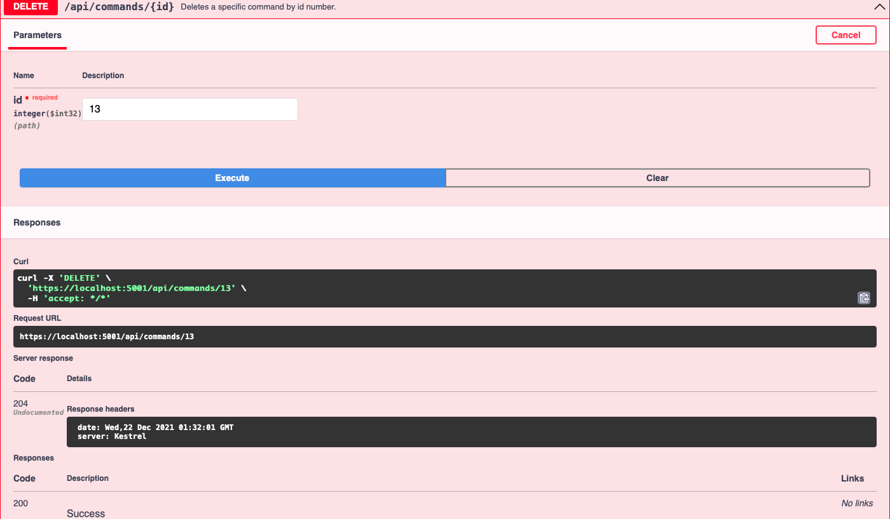

# CLI Commands REST API (ASP.NET Core MVC)
## Purpose
To help remember the abundance of CLI commands, this REST API stores command line snippets with a description of their functions and corresponding platforms. 
This project was built to learn how to construct a REST API using .NET Core using C# and the MVC design pattern. 

**The following techniques and technologies were used in the creation of this application:**
* REST API principles
* HTTP methods (GET, POST, DELETE, PUT, PATCH)
* Dependency injection
* Repository pattern
* Entity Framework Core O/RM (DBContext, Migration)
* Data Transfer Objects
* AutoMapper
* SQL Server Express
* SwaggerUI & Postman to Test API Endpoints
* Docker - image, container, and deployment to Docker Hub
* Azure Data Studio

## Overview
### Application Architecture:
**This API contains a Model, an internal representation of the data, and a Controller, the component that handles incoming requests, retrieves data, and returns responses through Action methods.**

### API CRUD Endpoints:
**The functions that the application can perform.**

### Swagger UI:
**Generates interactive documentation to test API calls.**

**Example: [HttpDelete] Deletes the command, gotten by id; returns "204 No Content" status code**

### Postman Endpoints:
#### [HttpPatch] Updating the value of the /howTo attribute; returns "204 No Content" status code 

#### [HttpPost] Creating a new command; returns location URI and "201 Created" status code

This project is based on a tutorial by Les Jackson.
